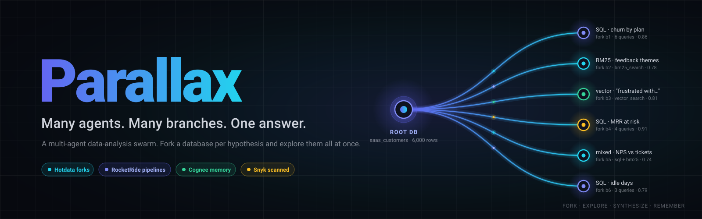
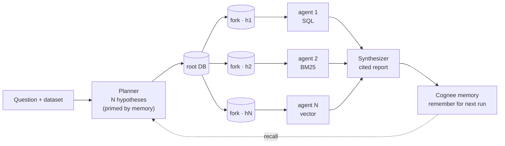
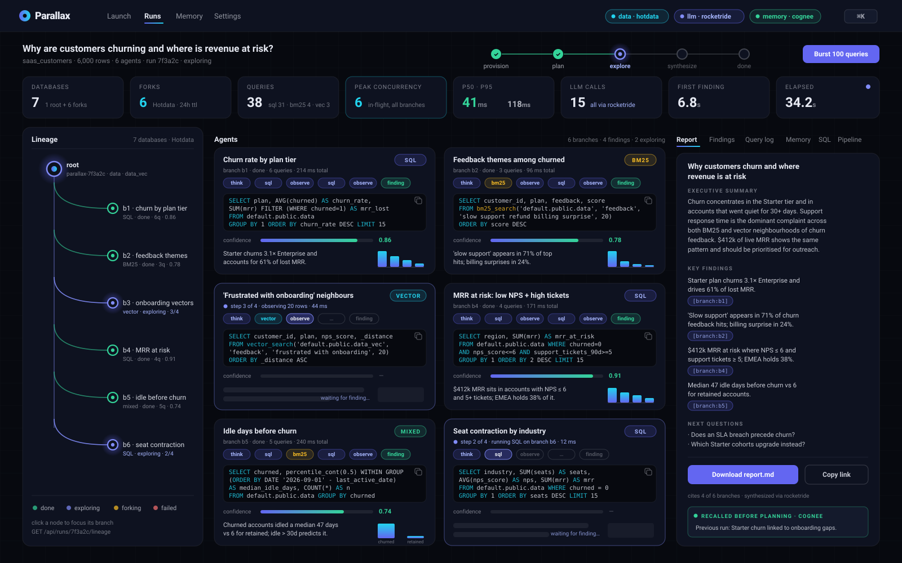
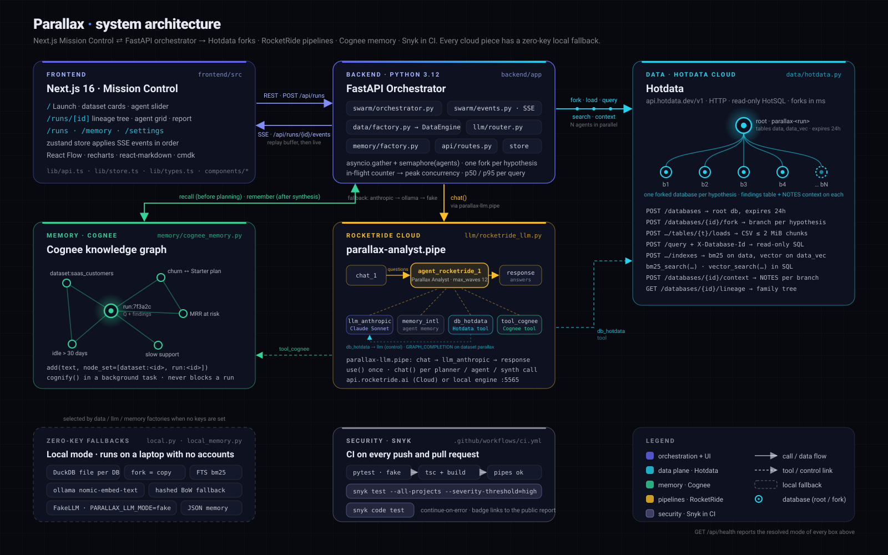

<div align="center">



<h1>Parallax</h1>

<p><strong>Many agents. Many branches. One answer.</strong></p>

<p>
Parallax is a multi-agent data-analysis swarm. Give it a dataset and a question; it forks an isolated <a href="https://hotdata.dev">Hotdata</a> database per hypothesis, runs analyst agents concurrently (SQL + BM25 + vector search), synthesizes one cited report, and remembers what it learned in <a href="https://cognee.ai">Cognee</a> so the next investigation starts smarter. Analyst reasoning runs as a <a href="https://rocketride.org">RocketRide</a> pipeline deployable to RocketRide Cloud, and the repo is continuously scanned by <a href="https://snyk.io">Snyk</a>.
</p>

<p>
<a href="LICENSE"></a>
<a href="https://github.com/vnmoorthy/parallax/actions/workflows/ci.yml"></a>
<a href="https://snyk.io/test/github/vnmoorthy/parallax"></a>


<br>
<a href="https://rocketride.org"></a>
<a href="https://hotdata.dev"></a>
<a href="https://cognee.ai"></a>
<a href="https://snyk.io"></a>
</p>

<p>
<a href="#quickstart"><strong>Live demo</strong></a> ·
<a href="docs/SPEC.md"><strong>Docs</strong></a> ·
<a href="docs/ARCHITECTURE.md"><strong>Architecture</strong></a> ·
<a href="docs/DEMO.md"><strong>Demo script</strong></a> ·
<a href="docs/JUDGES.md"><strong>Judges guide</strong></a>
</p>

</div>

---

## Why Parallax

**The problem.** Every analytics team has the same bottleneck: one analyst, one query at a time, one hypothesis at a time. A question like *"why are customers churning and where is revenue at risk?"* is really eight questions (by plan, by region, by what people wrote in their feedback, by how long they went quiet, by NPS versus tickets, …) and answering them serially takes a day. Pointing eight LLM agents at one shared database does not help either: they trip over each other's temp tables and indexes, and nobody can reproduce what any of them saw.

**The idea.** Fork the database per hypothesis. Parallax creates a root database, forks it once for every hypothesis the planner produces, and lets one agent loose on each fork *concurrently*. Every agent has its own snapshot, its own search indexes, its own scratch tables, its own notes. When they finish, a synthesizer writes one report where every claim cites the branch and the SQL that produced it, and the whole thing is written to a memory graph so the next run starts from what this one learned.

## How it works

1. 🌱 **Fork** — a root Hotdata database is created per run and the dataset loaded; the planner (primed by memory) proposes exactly *N* hypotheses with diverse strategies, and the root is forked once per hypothesis.
2. ⚡ **Explore concurrently** — *N* agents run under `asyncio.gather`; each loops think → SQL / BM25 / vector search → observe (up to 4 steps) on its own fork, then commits a finding with a confidence score, a `findings` row and a `NOTES` context doc.
3. 🧩 **Synthesize** — one report with an executive summary, key findings, next questions and `[branch:<id>]` citations you can click to jump to the evidence.
4. 🧠 **Remember** — the question and findings are written to Cognee with node sets per dataset and per run (in the background), and recalled before the next plan.



## See it

Mission Control during a run: status stepper and live metrics on top, the lineage tree of real database forks on the left, one card per agent with its SQL, step timeline and confidence in the middle, and the cited report on the right.



The three-minute walkthrough with exact clicks is in [`docs/DEMO.md`](docs/DEMO.md).

## Quickstart

```bash
git clone https://github.com/vnmoorthy/parallax
cd parallax
make setup      # uv sync (backend) + pnpm install (frontend)
make demo       # zero-key mode: DuckDB forks + fake LLM + local memory
```

Open **http://localhost:3000**, pick `saas_customers`, choose a suggested question, launch the swarm. No API keys are needed for this; the whole orchestrator, event stream and UI run locally. (`make dev` starts the same two servers, backend `:8000` and frontend `:3000`, using whatever keys are in `.env`. `docker compose up` is the containerised equivalent.)

### Turn on the cloud

Copy `.env.example` to `.env` and fill in any of the groups below. Every variable is optional and every subsystem resolves independently; `GET /api/health` and the badges in the UI show what you ended up with.

| Group | Variable | Where to get it |
|---|---|---|
| **Hotdata** | `HOTDATA_API_KEY`, `HOTDATA_WORKSPACE_ID` | [hotdata.dev](https://hotdata.dev) → workspace → API keys |
| | `HOTDATA_API_URL` | optional; default `https://api.hotdata.dev/v1` |
| | `PARALLAX_DATA_MODE` | `auto` (default: Hotdata if reachable, else local) · `hotdata` · `local` |
| **RocketRide Cloud** | `ROCKETRIDE_URI` | `https://api.rocketride.ai` for Cloud, or `http://localhost:5565` for the local Docker engine |
| | `ROCKETRIDE_APIKEY` | [cloud.rocketride.ai](https://cloud.rocketride.ai) → API key (local engine dev key is `MYAPIKEY`) |
| | `ROCKETRIDE_ANTHROPIC_KEY` | substituted into the `.pipe` files; falls back to `ANTHROPIC_API_KEY` |
| | `PARALLAX_LLM_MODE` | `auto` (default: first healthy of rocketride → anthropic → ollama) · `rocketride` · `anthropic` · `ollama` · `fake` |
| **Anthropic** | `ANTHROPIC_API_KEY`, `ANTHROPIC_MODEL` | [console.anthropic.com](https://console.anthropic.com); model default `claude-sonnet-4-5` |
| **Cognee** | `PARALLAX_MEMORY_MODE` | `auto` (default: Cognee if importable and configured, else local) · `cognee` · `local` |
| | `LLM_PROVIDER`, `LLM_MODEL`, `LLM_API_KEY` | Cognee's own LLM; `anthropic` + your Anthropic key works |
| | `EMBEDDING_PROVIDER`, `EMBEDDING_MODEL`, `EMBEDDING_ENDPOINT`, `EMBEDDING_DIMENSIONS` | `ollama` · `nomic-embed-text:latest` · `http://localhost:11434/api/embed` · `768` (`ollama pull nomic-embed-text`) |
| **Ollama** (local LLM + embeddings) | `OLLAMA_HOST`, `OLLAMA_MODEL`, `OLLAMA_EMBED_MODEL` | defaults `http://localhost:11434`, `llama3.1:8b`, `nomic-embed-text` |

The full table, including `PARALLAX_DATA_DIR` and `PARALLAX_MAX_AGENTS`, is in [`docs/SPEC.md` §2](docs/SPEC.md).

## Architecture



- **`DataEngine` abstraction** (`backend/app/data/base.py`). One protocol — `create_database`, `fork`, `load_csv`, `query`, `create_index`, `bm25_search`, `vector_search`, `lineage`, `set_context` — with two implementations: `HotdataEngine` over HTTP and `LocalEngine` over DuckDB files. The orchestrator never knows which one it has. `data/factory.py` picks Hotdata when credentials are present and `GET /v1/databases` succeeds.
- **The orchestrator** (`backend/app/swarm/orchestrator.py`) runs five phases — provisioning → planning → exploring → synthesizing → remember — and emits typed events after every state change. Peak concurrency is measured with an in-flight counter; every query's `elapsed_ms` feeds p50/p95.
- **SSE, not polling.** `GET /api/runs/{id}/events` replays a per-run buffer then streams live, so a refresh or a shared link rebuilds the exact same Mission Control. Runs are persisted as JSON under `.parallax/runs/` after every event.
- **Fallbacks everywhere.** LLM chain `rocketride → anthropic → ollama` with per-call fallback and provider attribution; Hotdata → DuckDB; Cognee → local JSON memory; Ollama embeddings → deterministic hashed embeddings. Zero-key mode runs the identical code path.

Deep dive, sequence diagram and the event table: [`docs/ARCHITECTURE.md`](docs/ARCHITECTURE.md).

## Hotdata

> Criterion: *"Build an application where multiple agents or users need to search, query, or analyze data concurrently."*

What we use — `backend/app/data/hotdata.py`:

- **Per-hypothesis database forks** via `POST /databases/{id}/fork`: one root per run (`POST /databases`, `expires_at: 24h`), one fork per agent, all queried at the same time.
- **Lineage** via `GET /databases/{id}/lineage`; the tree in Mission Control is that response.
- **Inline CSV loads** through `POST /databases/{id}/schemas/public/tables/{table}/loads`, chunked to 1.5 MiB, `replace` then `append`.
- **Read-only HotSQL** through `POST /query` with `X-Database-Id`; tables always fully qualified as `default.public.<t>`.
- **`bm25_search` + `vector_search`** on the dataset's text column: BM25 index on `data`, provider-backed vector index on a `data_vec` copy (a vector index must be the only index on its table); indexes created lazily per branch because forks do not carry them.
- **Per-DB context docs** (`POST /databases/{id}/context`) hold each agent's markdown `NOTES`; a `findings` table on each branch holds its result.
- **Burst mode** (`POST /api/runs/{id}/burst`) fires 10–200 concurrent reads across the forks and reports p50 / p95 / max.

## RocketRide

> Criterion: *"Build your project on RocketRide Cloud and deploy an AI pipeline without managing any infrastructure."*

What we use — `backend/app/llm/rocketride_llm.py`, `pipelines/`:

- **Every LLM call goes through a pipeline.** The backend routes planner, agent and synthesizer calls through `pipelines/parallax-llm.pipe` (`chat → llm_anthropic → response_answers`) with the `rocketride` SDK: `RocketRideClient(uri, auth)`, `use(filepath=…)` once with a cached token, `chat(token, Question)` per call.
- **`pipelines/parallax-analyst.pipe`** is the deployable analyst: an `agent_rocketride` node ("Parallax Analyst") controlling `llm_anthropic` (Claude), `memory_internal`, a **`db_hotdata`** tool node (Hotdata as an agent tool with execute allowed) and a **`tool_cognee`** node (`GRAPH_COMPLETION` over the `parallax` dataset).
- **Deployable to RocketRide Cloud.** Point `ROCKETRIDE_URI` at `https://api.rocketride.ai` and the pipeline executes on Cloud with nothing to host; the same file runs on the local Docker engine (`ghcr.io/rocketride-org/rocketride-engine:latest`, port 5565). Steps in `pipelines/README.md`; `make pipes-validate` checks the files.
- The Mission Control **Pipeline** tab renders the `.pipe` as a node graph with the Cloud status from `/api/health`; the metrics strip shows LLM calls by provider.

## Cognee

> Criterion: *"Build persistent memory and context for your AI agents."*

What we use — `backend/app/memory/cognee_memory.py`:

- **`add` → `cognify` → `search`.** After each run: `cognee.add(text, dataset_name="parallax", node_set=[dataset_id, "run:<id>"])` then `cognee.cognify(datasets=["parallax"])` in a background task. Before each plan: `cognee.search(query_type=SearchType.GRAPH_COMPLETION, datasets=["parallax"], top_k=8)`.
- **Node sets per dataset** keep memories scoped: recalls for `ecommerce_orders` never surface SaaS churn facts.
- **Memory primes the planner.** Recalled hits are streamed as `run.recalled`, shown in the Memory tab, and injected into the planner prompt.
- **The graph is rendered in `/memory`** via `cognee.visualize_graph()` served at `GET /api/memory/graph`; `POST /api/memory/recall` is the search box.
- Cognee is also a tool for the RocketRide agent (`tool_cognee`), and if it cannot initialise the app falls back to `LocalMemory` with the same protocol.

## Snyk

- **CI job** in `.github/workflows/ci.yml`: `snyk test --all-projects --severity-threshold=high` and `snyk code test` on every push and pull request (`continue-on-error`, skipped gracefully when `SNYK_TOKEN` is absent).
- **Badge** at the top of this page links to the public report; `make snyk` runs the same scans locally.
- **[`SECURITY.md`](SECURITY.md)** covers disclosure, the read-only SQL guard, per-branch isolation and server-side-only secrets.

## API

All JSON under `/api`; errors are `{error:{code,message}}`. Full detail in [`docs/SPEC.md` §4](docs/SPEC.md).

| Method | Path | Purpose |
|---|---|---|
| `GET` | `/health` | Resolved modes: `data`, `llm` (chain + active), `memory`, `rocketride` reachability, version |
| `GET` | `/datasets` | Bundled + uploaded datasets with columns, text columns, suggested questions |
| `POST` | `/datasets/upload` | Multipart CSV (≤ 25 MB) → dataset |
| `GET` | `/datasets/{id}/preview?limit=20` | Rows + per-column profile |
| `POST` | `/runs` | `{dataset_id, question, agents (2..16), search_column?}` → `{run_id}` |
| `GET` | `/runs` | Run summaries, newest first |
| `GET` | `/runs/{id}` | Full `Run` (plan, branches, steps, findings, report, metrics) |
| `GET` | `/runs/{id}/events` | **SSE**: replay then live; ends with `run.finished` |
| `POST` | `/runs/{id}/query` | `{branch_id, sql}` → `QueryResult` (read-only console) |
| `POST` | `/runs/{id}/search` | `{branch_id, kind: bm25 \| vector, q, k}` → `QueryResult` |
| `GET` | `/runs/{id}/lineage` | Root + all forks |
| `GET` | `/runs/{id}/report.md` | Markdown download |
| `POST` | `/runs/{id}/burst` | `{queries: 10..200}` → `{count, p50_ms, p95_ms, max_ms, total_ms, per_query}` |
| `DELETE` | `/runs/{id}` | Delete run and its databases |
| `GET` | `/memory` | `{kind, stats, recent}` |
| `POST` | `/memory/recall` | `{q, tags?}` → hits |
| `GET` | `/memory/graph` | Cognee graph HTML (404 in local mode) |

## Datasets

| id | Rows | Source | Text column | Try asking |
|---|---|---|---|---|
| `saas_customers` | 6,000 | synthetic, seeded | `feedback` | "Why are customers churning and where is revenue at risk?" · "Which segments have the best expansion potential?" |
| `ecommerce_orders` | 8,000 | synthetic | `review_text` | "What drives returns and low ratings?" · "Where should we invest marketing next quarter?" |
| `sf_airbnb_listings` | real | fetched from [hotdata.dev](https://hotdata.dev/data/sf-airbnb-listings.parquet) by `scripts/fetch_datasets.py` (synthetic stand-in if offline) | `description` | "What makes a listing command a premium price?" · "Which neighborhoods are under-supplied for families?" |

Add your own: drop a CSV on the Launch page, or register a file in `datasets/registry.json` ([`docs/FAQ.md`](docs/FAQ.md#5-how-do-i-add-a-dataset)).

## Project structure

```
parallax/
├── backend/                 # Python 3.12 · FastAPI · uv
│   ├── app/
│   │   ├── main.py          # app factory, CORS, routers, lifespan
│   │   ├── config.py        # pydantic-settings; reads .env
│   │   ├── api/routes.py    # HTTP + SSE endpoints
│   │   ├── data/            # base.py (DataEngine) · hotdata.py · local.py · factory.py
│   │   ├── llm/             # base.py · router.py · rocketride_llm.py · anthropic_llm.py · ollama_llm.py
│   │   ├── memory/          # base.py · cognee_memory.py · local_memory.py · factory.py
│   │   ├── swarm/           # orchestrator.py · prompts.py · events.py · models.py · store.py
│   │   └── datasets.py      # registry, preview, profiling
│   ├── tests/               # pytest: LocalEngine, orchestrator with FakeLLM, API smoke
│   └── pyproject.toml
├── frontend/                # Next.js 16 · React 19 · Tailwind v4 · zustand · React Flow · recharts
│   └── src/{app,components,lib}
├── pipelines/               # parallax-llm.pipe · parallax-analyst.pipe · README.md · .env.example
├── datasets/                # bundled CSVs + registry.json
├── scripts/                 # dev.sh · generate_datasets.py · fetch_datasets.py · validate_pipes.py
├── docs/                    # SPEC.md · ARCHITECTURE.md · DEMO.md · JUDGES.md · FAQ.md · assets/
├── deck/                    # Parallax.pptx + STORYBOARD.md
├── .github/                 # workflows/ci.yml · issue + PR templates · CODEOWNERS
├── Makefile · docker-compose.yml · .env.example
└── README.md · LICENSE · SECURITY.md · CONTRIBUTING.md · CODE_OF_CONDUCT.md · CHANGELOG.md
```

## Zero-key local mode

`make demo` (or `PARALLAX_DATA_MODE=local PARALLAX_LLM_MODE=fake`) runs the identical orchestrator, event protocol, persistence and UI with:

- **DuckDB** — one file per database under `.parallax/dbs/`; `fork` = close + copy the file; lineage and context docs in `manifest.json`.
- **FTS** — BM25 via DuckDB's `fts` extension on an integer `__rowid`.
- **Ollama embeddings** — `nomic-embed-text` into a `FLOAT[768]` column with `array_cosine_similarity`; if Ollama is not running, a deterministic hashed bag-of-words embedding keeps the vector path alive.
- **Fake LLM** — canned planner / agent / synthesizer JSON, which is also how CI smoke-tests a full run on every commit. With Ollama installed, `PARALLAX_LLM_MODE=ollama` gives you real local reasoning.

## Roadmap

- [ ] **Merge branches** — combine two forks' findings into a third fork for follow-up hypotheses
- [ ] **Hotdata bulk-create** — `POST /databases/bulk` to spin up 10k tenant databases for multi-tenant swarms
- [ ] **RocketRide deploy button** in the Pipeline tab (`client.deploy.*`)
- [ ] **Cognee temporal memory** — `SearchType.TEMPORAL` so recalls can be scoped to "since last quarter"
- [ ] **Multi-user live cursors** on Mission Control

Shipped in 0.1.0: see [`CHANGELOG.md`](CHANGELOG.md).

## Contributing

`make setup`, `make dev`, `make test`. Ruff on the backend, ESLint on the frontend, Conventional Commits, and a PR checklist that includes "zero-key mode still completes a run". Details in [`CONTRIBUTING.md`](CONTRIBUTING.md); please read the [Code of Conduct](CODE_OF_CONDUCT.md).

## Security

Read-only SQL by construction and by guard, per-branch isolation with 24 h expiry, secrets only ever server-side, Snyk on every push. Report vulnerabilities privately as described in [`SECURITY.md`](SECURITY.md).

## License

[MIT](LICENSE) © 2026 Moorthy ([@vnmoorthy](https://github.com/vnmoorthy)).

---

<div align="center">

Built in 8 hours at the <a href="https://luma.com/qisv9xmg">Data &amp; AI Hackathon</a> · AWS Builder Loft, San Francisco · September 11, 2026

<a href="https://rocketride.org">RocketRide</a> · <a href="https://hotdata.dev">Hotdata</a> · <a href="https://cognee.ai">Cognee</a> · <a href="https://snyk.io">Snyk</a>

</div>
