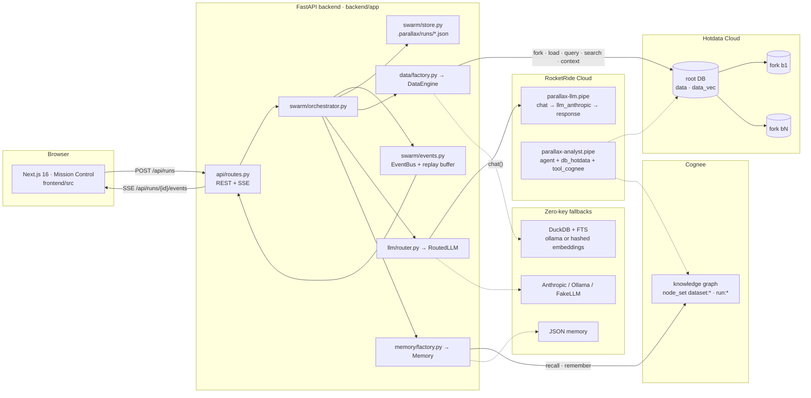
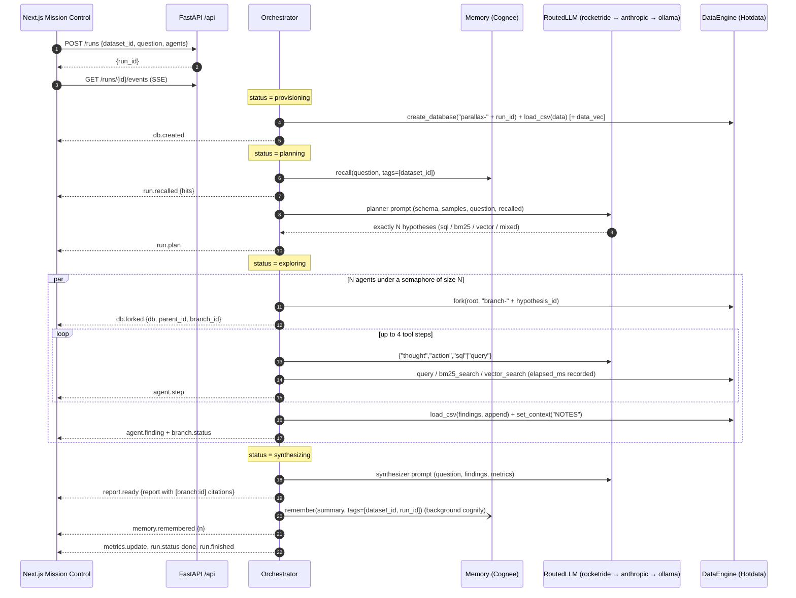

# Parallax architecture

> Source of truth for behaviour is [`SPEC.md`](SPEC.md). This document explains *why* the system is shaped the way it is and how the pieces talk to each other. Section numbers in brackets (e.g. [§5]) refer to the spec.


## 1. Components



| Layer | Where | Responsibility |
|---|---|---|
| UI | `frontend/` (Next.js 16, App Router, Tailwind v4, zustand, React Flow, recharts) | Launch runs, render Mission Control from the SSE stream, ad-hoc SQL console, memory browser, connection status [§6] |
| API | `backend/app/api/routes.py` | All HTTP + SSE endpoints under `/api` [§4]; CORS; `{error:{code,message}}` envelopes |
| Orchestrator | `backend/app/swarm/orchestrator.py` | The run engine: provision → plan → explore → synthesize → remember [§5] |
| Event bus | `backend/app/swarm/events.py` | Per-run asyncio queues plus a replay buffer so late SSE subscribers see everything |
| Run store | `backend/app/swarm/store.py` | Debounced JSON persistence under `.parallax/runs/` after every event |
| Data engines | `backend/app/data/{base,hotdata,local,factory}.py` | `DataEngine` protocol; Hotdata over HTTP; DuckDB locally [§3.1] |
| LLMs | `backend/app/llm/{base,router,rocketride_llm,anthropic_llm,ollama_llm}.py` | `RoutedLLM` chain with per-call fallback and provider attribution [§3.2] |
| Memory | `backend/app/memory/{base,cognee_memory,local_memory,factory}.py` | `Memory` protocol; Cognee graph or local JSON [§3.3] |
| Pipelines | `pipelines/parallax-llm.pipe`, `pipelines/parallax-analyst.pipe` | RocketRide pipelines; the first carries every LLM call when RocketRide is configured, the second is the deployable analyst agent [§7] |
| Datasets | `backend/app/datasets.py`, `datasets/registry.json` | Bundled + uploaded dataset registry, preview, profiling [§8] |

## 2. Anatomy of a run



Time to first finding is measured from `started_at` to the first `agent.finding`; the whole run is persisted after every event so a page refresh (or a second browser) replays the same story.

## 3. Data model

Pydantic models live in `backend/app/swarm/models.py` and are mirrored by hand in `frontend/src/lib/types.ts` [§5].

| Model | Key fields | Notes |
|---|---|---|
| `Run` | `id, status, dataset_id, question, agents, modes, root_db, branches[], recalled[], plan[], report, metrics, error` | `status ∈ queued · provisioning · planning · exploring · synthesizing · done · failed`; `modes` records the resolved data / llm / memory backends |
| `Hypothesis` | `id, title, rationale, approach, target_columns` | `approach ∈ sql · bm25 · vector · mixed` |
| `Branch` | `id, hypothesis_id, db, status, steps[], finding` | One per hypothesis; `db` is the forked database |
| `AgentStep` | `n, kind, text, sql, result, elapsed_ms, provider` | `kind ∈ think · sql · bm25 · vector · observe · finding`; `provider` is which LLM served the step |
| `Finding` | `claim, evidence, confidence, supporting_sql[], chart, tags` | `chart` is a `ChartSpec` built from the last result |
| `ChartSpec` | `type, title, x, y, data[]` | `type ∈ bar · line · pie · number` |
| `Report` | `title, executive_summary, markdown, key_findings[], next_questions[], citations[]` | citations are `{branch_id, hypothesis}`; the markdown contains `[branch:<id>]` chips |
| `Metrics` | `databases_created, forks, queries, peak_concurrency, p50_ms, p95_ms, llm_calls, llm_calls_by_provider, started_at, finished_at, elapsed_ms, time_to_first_finding_ms, burst` | `burst` is filled by `POST /runs/{id}/burst` |
| `Event` | `ts, type, run_id, branch_id?, payload` | The SSE envelope |

`DataEngine` dataclasses [§3.1]: `DB(id, name, parent_id, created_at, expires_at, connection_id)`, `QueryResult(columns, rows, row_count, elapsed_ms, truncated, sql)`, `TableInfo(name, columns, row_count)`, `LineageNode(id, name, parent_id, created_at, exists)`.

## 4. Event protocol (SSE)

`GET /api/runs/{id}/events` replays the buffered events for the run, then streams live ones. Each `data:` line is one `Event` JSON. The stream always ends with `run.finished`.

| `type` | `payload` | Emitted when |
|---|---|---|
| `run.status` | `{status}` | Every phase transition |
| `run.recalled` | `{hits: MemoryHit[]}` | After `Memory.recall()` before planning |
| `run.plan` | `{hypotheses: Hypothesis[]}` | Planner returned exactly `agents` hypotheses |
| `db.created` | `{db: DB}` | Root database provisioned and dataset loaded |
| `db.forked` | `{db: DB, parent_id, branch_id}` | A branch forked from the root |
| `agent.step` | `{step: AgentStep}` | Each think / sql / bm25 / vector / observe step |
| `agent.finding` | `{finding: Finding}` | Agent returned `action: finish` |
| `branch.status` | `{status}` | `forking → exploring → done | failed` per branch (`branch_id` set) |
| `metrics.update` | `{metrics: Metrics}` | Live counters changed (queries, peak concurrency, latency) |
| `metrics.burst` | `{count, p50_ms, p95_ms, max_ms, total_ms, per_query[]}` | `POST /runs/{id}/burst` completed |
| `report.ready` | `{report: Report}` | Synthesizer finished |
| `memory.remembered` | `{n}` | Background `remember()` accepted the run summary |
| `run.error` | `{message}` | Unrecoverable failure; `status` becomes `failed` |
| `run.finished` | `{}` | Terminal; the SSE connection closes |

The frontend's zustand store (`frontend/src/lib/store.ts`) applies these in order; it never polls `GET /runs/{id}` except on first load.

## 5. The `DataEngine` abstraction and fork-per-hypothesis

```python
class DataEngine(Protocol):
    kind: str  # "hotdata" | "local"
    async def create_database(self, name, *, expires="24h") -> DB
    async def fork(self, db_id, name) -> DB
    async def load_csv(self, db_id, table, csv_text, *, mode="replace", columns=None) -> int
    async def query(self, db_id, sql, *, limit=200) -> QueryResult
    async def tables(self, db_id) -> list[TableInfo]
    async def create_index(self, db_id, table, column, kind) -> str      # "bm25" | "vector"
    async def bm25_search(self, db_id, table, column, q, k=10) -> QueryResult
    async def vector_search(self, db_id, table, column, q, k=10) -> QueryResult
    async def lineage(self, db_id) -> list[LineageNode]
    async def set_context(self, db_id, name, content) -> None
    async def get_context(self, db_id) -> dict[str, str]
    async def delete(self, db_id) -> None
    def table_ref(self, db_id, table) -> str   # hotdata: default.public.<t> · local: <t>
```

The orchestrator only ever talks to this protocol. `data/factory.py` picks `HotdataEngine` when `HOTDATA_API_KEY` + `HOTDATA_WORKSPACE_ID` are set and `GET /v1/databases` succeeds, otherwise `LocalEngine` (`PARALLAX_DATA_MODE=auto`).

**Why fork a database per hypothesis instead of sharing one?**

- **Isolation.** Each agent gets its own tables, its own `findings` table, and its own `NOTES` context doc. An agent that creates a `data_vec` copy or an index cannot slow down or confuse another agent. A bad query is contained to a disposable branch.
- **Reproducibility.** A branch is a snapshot of the root at fork time. The report cites `[branch:<id>]`; anyone can open the SQL console, pick that branch, and re-run the agent's `supporting_sql` against exactly the data it saw.
- **Lineage.** Hotdata's `GET /databases/{id}/lineage` returns the whole family tree (root, ancestors, forks with `exists` flags). Mission Control's tree *is* that response; it is not a UI-side invention.
- **Concurrency without contention.** Hotdata forks copy schema, tables and data server-side in milliseconds, and each fork has its own query path, so N agents can hammer N databases at once. That is precisely the "multiple agents need to search, query, or analyze data concurrently" shape.
- **Cheap cleanup.** Root and forks are created with `expires_at: 24h`; `DELETE /api/runs/{id}` removes the run and every database it created.

Hotdata specifics honoured by `HotdataEngine`: every call carries `Authorization: Bearer` and `X-Workspace-Id`; queries carry `X-Database-Id`; tables are always referenced as `default.public.<t>`; CSV loads are inline and chunked to 1.5 MiB (`mode=replace` first, then `append`); forks do not carry indexes, so BM25 and vector indexes are created lazily on the branch that first needs them and cached per branch; a provider-backed vector index must be the only index on its table, so vector search runs on a `data_vec` copy while BM25 stays on `data`; `bm25_search(...)`/`vector_search(...)` results are explicitly `ORDER BY score DESC` / `ORDER BY _distance ASC`.

`LocalEngine` mirrors the same surface with one DuckDB file per database under `.parallax/dbs/<id>.duckdb`: fork = close + copy file; BM25 via the DuckDB `fts` extension on an integer `__rowid`; vector search via Ollama `nomic-embed-text` embeddings stored in `<col>__emb FLOAT[768]` and `array_cosine_similarity`, falling back to a deterministic hashed bag-of-words embedding when Ollama is not running; lineage and context docs live in `.parallax/dbs/manifest.json`.

## 6. Concurrency model

- **Fan-out.** `exploring` is `asyncio.gather` over the hypotheses, bounded by `asyncio.Semaphore(agents)`. Each agent is an independent coroutine: fork → up to 4 tool steps → finding. Nothing shares mutable state except the metrics object and the event bus.
- **Peak concurrency.** Every engine call increments an in-flight counter on entry and decrements on exit; `Metrics.peak_concurrency` is the high-water mark. With 8 agents you should see 8 during the exploring phase.
- **Latency percentiles.** Every `QueryResult` carries `elapsed_ms` (Hotdata's `execution_time_ms`, or a wall-clock timer for DuckDB). The orchestrator keeps the list and publishes `p50_ms` / `p95_ms` in `metrics.update`.
- **Burst mode.** `POST /api/runs/{id}/burst {queries: 10..200}` fires N concurrent read-only queries spread round-robin across the run's branches and returns `{count, p50_ms, p95_ms, max_ms, total_ms, per_query[]}`; the UI renders a latency histogram. It is the "many users at once" story on top of the "many agents at once" story, and it runs against the same forked databases.
- **LLM calls are not the bottleneck by design.** Planner, N agent loops and the synthesizer all go through `RoutedLLM`; agent loops overlap with each other and with their own queries, so wall-clock time is dominated by the slowest single branch rather than the sum.
- **Memory never blocks.** `remember()` schedules `cognee.add` + `cognify` with `asyncio.create_task`; the run reaches `done` without waiting for the graph to build.

## 7. Failure modes and fallbacks

| Subsystem | Preferred | Fallback chain | Selected by |
|---|---|---|---|
| Data | Hotdata Cloud | `LocalEngine` (DuckDB; fork = file copy; FTS; Ollama or hashed embeddings) | `PARALLAX_DATA_MODE=auto`, key + workspace present and `GET /v1/databases` succeeds |
| LLM | RocketRide (`parallax-llm.pipe`) | `anthropic` → `ollama` → `fake` (per call, on exception) | `PARALLAX_LLM_MODE=auto`; first healthy provider in the chain; `fake` when set explicitly |
| Memory | Cognee | `LocalMemory` (JSON + Ollama embeddings) | `PARALLAX_MEMORY_MODE=auto`; Cognee importable and both an LLM and an embedding provider configured, else local |
| Vector index on Hotdata | provider-backed vector index on `data_vec` | report "vector unavailable" and continue with BM25 | index creation error (no system embedding provider on the workspace) |
| Ollama | `nomic-embed-text` embeddings | deterministic hashed bag-of-words embedding | `OLLAMA_HOST` unreachable |
| SQL error inside an agent step | — | one retry with the error message in context, then `observe` the failure | orchestrator guardrails |
| Whole run | — | `run.error` event, `status: failed`, partial branches/findings kept and persisted | any uncaught exception in the run task |

Zero-key mode (`make demo`, or `PARALLAX_LLM_MODE=fake PARALLAX_DATA_MODE=local`) exercises the exact same orchestrator, event protocol, store and UI; CI runs the backend tests that way. `GET /api/health` reports the resolved mode of each subsystem so the UI badges (`data: hotdata`, `llm: rocketride`, `memory: cognee`) always tell the truth.

## 8. Security

- **Read-only SQL guard.** HotSQL is read-only at the platform level. The orchestrator additionally strips trailing semicolons, rejects anything that is not `SELECT` / `WITH`, and appends `LIMIT` when missing. The same guard covers the ad-hoc console (`POST /api/runs/{id}/query`) and the DuckDB engine, so no code path can mutate or drop a table through SQL. Writes only happen through `load_csv` (Hotdata loads API / DuckDB `COPY`) on tables the run created.
- **Secrets stay server-side.** `backend/app/config.py` reads `.env` / environment; nothing secret is sent to the browser. `/settings` shows env-var names and health, never values. `.env` is git-ignored.
- **Blast radius.** Every agent works inside its own forked database with a 24 h expiry; uploads (≤ 25 MB CSV) go into fresh tables in fresh databases.
- **Supply chain.** `.github/workflows/ci.yml` runs `snyk test --all-projects --severity-threshold=high` and `snyk code test` on every push and PR (continue-on-error so a missing token never blocks a merge); the README badge links to the public Snyk report. See [`../SECURITY.md`](../SECURITY.md) for the disclosure policy.

## 9. Storage layout

```
.parallax/                 # PARALLAX_DATA_DIR (git-ignored)
├── runs/<run_id>.json     # full Run model, rewritten (debounced) after every event
├── dbs/<db_id>.duckdb     # LocalEngine databases (root + forks)
├── dbs/manifest.json      # LocalEngine lineage + context docs
├── uploads/               # user-uploaded CSVs
└── cognee/                # Cognee system + data root when memory is cognee
```
